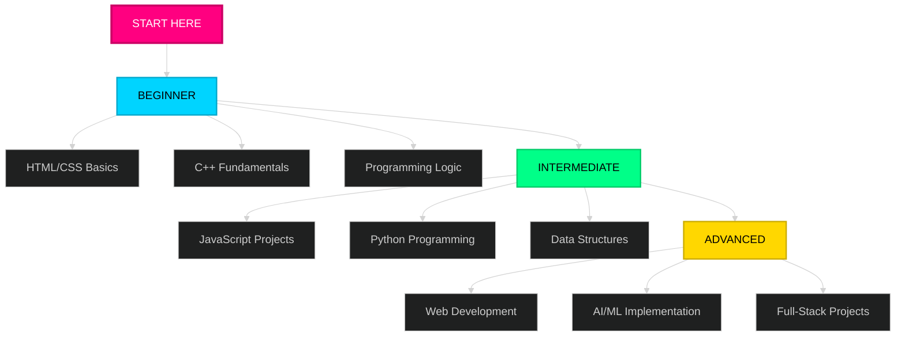

<div align="center">

```
██████╗  ██████╗      ██╗██╗ ██████╗██████╗ ███████╗ █████╗ ████████╗███████╗███████╗
██╔══██╗██╔═══██╗     ██║██║██╔════╝██╔══██╗██╔════╝██╔══██╗╚══██╔══╝██╔════╝██╔════╝
██║  ██║██║   ██║     ██║██║██║     ██████╔╝█████╗  ███████║   ██║   █████╗  ███████╗
██║  ██║██║   ██║██   ██║██║██║     ██╔══██╗██╔══╝  ██╔══██║   ██║   ██╔══╝  ╚════██║
██████╔╝╚██████╔╝╚█████╔╝██║╚██████╗██║  ██║███████╗██║  ██║   ██║   ███████╗███████║
╚═════╝  ╚═════╝  ╚════╝ ╚═╝ ╚═════╝╚═╝  ╚═╝╚══════╝╚═╝  ╚═╝   ╚═╝   ╚══════╝╚══════╝
```

**Empowering God-Fearing Filipino Developers Through Technology & Growth**


<br>

## ALWAYS REMEMBER

> # _"... Ang Panginoon ay nagbibigay ng karunungan, sa kaniyang bibig nanggagaling ang kaalaman at kaunawaan."_
> 
> ## Sa lahat ng mabuting bagay na ating matututunan, ang lagi nating pasasalamat ay sa Dios lamang.

<br>


## PROJECTS

<table>
<tr>
<th width="40%" align="left">Project</th>
<th width="40%" align="left">Description</th>
<th width="20%" align="center">Link</th>
</tr>
<tr>
<td><strong>Example Project 1</strong></td>
<td>A brief description of your first project. Add more details here about what it does and the technologies used.</td>
<td align="center"><a href="https://github.com/yourusername/project1" target="_blank"> View Repo</a></td>
</tr>
<tr>
<td><strong>Example Project 2</strong></td>
<td>A brief description of your second project. Feel free to expand on features, challenges overcome, or learning outcomes.</td>
<td align="center"><a href="https://github.com/yourusername/project2" target="_blank"> View Repo</a></td>
</tr>
<tr>
<td><strong>Example Project 3</strong></td>
<td>A brief description of your third project. This is a placeholder—replace with your actual GitHub repos.</td>
<td align="center"><a href="https://github.com/yourusername/project3" target="_blank"> View Repo</a></td>
</tr>
<!-- Add more rows as needed for your projects -->
</table>


## CORE VALUES

<table>
<tr>
<td align="center" width="20%">
<span style="pointer-events: none; display:inline-block;">

</span>
<br><br>
<strong>CLARITY</strong>
<br>
<sub>Tagalog explanations<br>for better understanding</sub>
</td>
<td align="center" width="20%">
<span style="pointer-events: none; display:inline-block;">

</span>
<br><br>
<strong>VALUE</strong>
<br>
<sub>Free quality content<br>for everyone</sub>
</td>
<td align="center" width="20%">
<span style="pointer-events: none; display:inline-block;">

</span>
<br><br>
<strong>CONSISTENCY</strong>
<br>
<sub>Regular tutorials<br>and updates</sub>
</td>
<td align="center" width="20%">
<span style="pointer-events: none; display:inline-block;">

</span>
<br><br>
<strong>INNOVATION</strong>
<br>
<sub>Modern tech<br>education</sub>
</td>
<td align="center" width="20%">
<span style="pointer-events: none; display:inline-block;">

</span>
<br><br>
<strong>FAITH</strong>
<br>
<sub>God-honoring<br>work</sub>
</td>
</tr>
</table>


<br>

## TUTORIAL CATEGORIES

<table>
<tr>
<td align="center" width="20%">
<strong>Web Dev</strong><br><br>
HTML5 Basics<br>
CSS Styling<br>
JavaScript<br>
React & Tailwind<br><br>

</td>
<td align="center" width="20%">
<strong>C/C++</strong><br><br>
Syntax & Structure<br>
Data Structures<br>
Algorithms<br>
Memory Management<br><br>

</td>
<td align="center" width="20%">
<strong>Python</strong><br><br>
Getting Started<br>
File Handling<br>
Libraries<br>
Projects<br><br>

</td>
<td align="center" width="20%">
<strong>Java</strong><br><br>
OOP Concepts<br>
Inheritance<br>
Polymorphism<br>
Java Projects<br><br>

</td>
<td align="center" width="20%">
<strong>AI/ML</strong><br><br>
Neural Networks<br>
ML Algorithms<br>
Automation<br>
AI Projects<br><br>

</td>
</tr>
</table>

<br>

## FEATURED TUTORIALS

<table>
<tr>
<td width="50%" align="center">
<a href="https://youtu.be/6XJ8294lC0c?si=hnEpeA_CLGzL1gMG">

</a>
<br><br>
<a href="https://youtu.be/6XJ8294lC0c">

</a>
</td>
<td width="50%" align="center">
<a href="https://youtu.be/Pyx9oLYpbi4?si=Aqr284t4U4DmPUJR">

</a>
<br><br>
<a href="https://youtu.be/Pyx9oLYpbi4">

</a>
</td>
</tr>
<tr>
<td width="50%" align="center">
<a href="https://youtu.be/xZ9umpUHRdU?si=wOZ9S9jMXe5jHn6l">

</a>
<br><br>
<a href="https://youtu.be/xZ9umpUHRdU">

</a>
</td>
<td width="50%" align="center">
<a href="https://youtu.be/te1eLWfdd0I?si=Tx2pQ-ijfx9BxW5M">

</a>
<br><br>
<a href="https://youtu.be/te1eLWfdd0I">

</a>
</td>
</tr>
</table>

### [**VIEW ALL TUTORIALS →**](https://youtube.com/@dojicreates)

<br>

## LEARNING TRAJECTORY


<br>

## LEARNING PATH



<br>

## CONTENT FOCUS AREAS


<br>

## CORE MODULES

<table>
<tr>
<td align="center" width="25%">

<br><br>
<strong>PROGRAMMING</strong>
<br><br>
The foundation of all tech innovation. Programming trains your logic, creativity, and problem-solving mindset.
</td>
<td align="center" width="25%">

<br><br>
<strong>AI & ROBOTICS</strong>
<br><br>
Understanding AI and automation prepares you for the next era of technology where computers think and machines learn.
</td>
<td align="center" width="25%">

<br><br>
<strong>GROWTH</strong>
<br><br>
Tech alone isn't enough. Mindset, habits, and discipline fuel consistency, helping you become better every day.
</td>
<td align="center" width="25%">

<br><br>
<strong>WELLNESS</strong>
<br><br>
A strong body and clear mind lead to sustainable productivity. Mental focus is your long-term asset.
</td>
</tr>
</table>

<br>

## RESOURCES AVAILABLE

<table>
<tr>
<td align="center" width="25%">

<br><br>
<strong>Video Tutorials</strong>
<br><br>
Full-length Tagalog coding lessons with hands-on examples
</td>
<td align="center" width="25%">

<br><br>
<strong>PDF Notes</strong>
<br><br>
Downloadable study materials and comprehensive guides
</td>
<td align="center" width="25%">

<br><br>
<strong>Source Code</strong>
<br><br>
GitHub repositories and project files ready to use
</td>
<td align="center" width="25%">

<br><br>
<strong>Dev Tools</strong>
<br><br>
Utilities and helper applications for productivity
</td>
</tr>
</table>

<br>

## CONTENT PHILOSOPHY

<table>
<tr>
<td align="center" width="33.33%">

<br><br>
<strong>EDUCATE</strong>
<br><br>
Tagalog programming tutorials made free and accessible for all Filipino learners
</td>
<td align="center" width="33.33%">

<br><br>
<strong>INSPIRE</strong>
<br><br>
Showing what's achievable while building Filipino tech excellence
</td>
<td align="center" width="33.33%">

<br><br>
<strong>EMPOWER</strong>
<br><br>
Practical skills and projects with real-world applications
</td>
</tr>
</table>

<br>

## TECHNOLOGY STACK

**Frontend Development**

<table>
<tr>
<td align="center" width="14.28%">

<br><strong>HTML5</strong>
</td>
<td align="center" width="14.28%">

<br><strong>CSS3</strong>
</td>
<td align="center" width="14.28%">

<br><strong>JavaScript</strong>
</td>
<td align="center" width="14.28%">

<br><strong>TypeScript</strong>
</td>
<td align="center" width="14.28%">

<br><strong>React</strong>
</td>
<td align="center" width="14.28%">

<br><strong>Bootstrap</strong>
</td>
<td align="center" width="14.28%">

<br><strong>Tailwind</strong>
</td>
</tr>
</table>

**Backend & Programming Languages**

<table>
<tr>
<td align="center" width="14.28%">

<br><strong>Node.js</strong>
</td>
<td align="center" width="14.28%">

<br><strong>Python</strong>
</td>
<td align="center" width="14.28%">

<br><strong>Java</strong>
</td>
<td align="center" width="14.28%">

<br><strong>C</strong>
</td>
<td align="center" width="14.28%">

<br><strong>C++</strong>
</td>
<td align="center" width="14.28%">

<br><strong>C#</strong>
</td>
<td align="center" width="14.28%">

<br><strong>Vite</strong>
</td>
</tr>
</table>

**Tools & Version Control**

<table>
<tr>
<td align="center" width="14.28%">

<br><strong>Git</strong>
</td>
<td align="center" width="14.28%">

<br><strong>GitHub</strong>
</td>
<td align="center" width="14.28%">

<br><strong>VS Code</strong>
</td>
<td align="center" width="14.28%">

<br><strong>Figma</strong>
</td>
<td align="center" width="14.28%">

<br><strong>Android Studio</strong>
</td>
<td align="center" width="14.28%">
</td>
<td align="center" width="14.28%">
</td>
</tr>
</table>

<br>

## CREATIVE & OTHER INTERESTS

**Content Creation & Multimedia**

<table>
<tr>
<td align="center" width="14.28%">

<br><strong>Premiere Pro</strong>
</td>
<td align="center" width="14.28%">

<br><strong>After Effects</strong>
</td>
<td align="center" width="14.28%">

<br><strong>CapCut</strong>
</td>
<td align="center" width="14.28%">

<br><strong>Photography</strong>
</td>
<td align="center" width="14.28%">

<br><strong>Video Editing</strong>
</td>
<td align="center" width="14.28%">

<br><strong>Content Creation</strong>
</td>
<td align="center" width="14.28%">

<br><strong>Digital Arts</strong>
</td>
</tr>
</table>

**Music & Personal Growth**

<table>
<tr>
<td align="center" width="14.28%">

<br><strong>Music</strong>
</td>
<td align="center" width="14.28%">

<br><strong>Ableton Live</strong>
</td>
<td align="center" width="14.28%">

<br><strong>Finance</strong>
</td>
<td align="center" width="14.28%">

<br><strong>Health & Wellness</strong>
</td>
<td align="center" width="14.28%">
</td>
<td align="center" width="14.28%">
</td>
<td align="center" width="14.28%">
</td>
</tr>
</table>

<br>

## DEVELOPER MINDSET

<table>
<tr>
<td width="33.33%" valign="top">

```javascript
const logic_NotLanguage = {
  foundation: "Wag ka munang magmadali matuto ng maraming programming languages, unahin mo muna ang pag-master ng problem-solving.",
  
  mindset: "Kapag naintindihan mo na kung paano mag-isip tulad ng isang programmer, madali na lang magpalit ng kahit anong language.",
  
  practice: "Mag-practice muna ng pseudocode, algorithms, at flowcharts bago ka lumalim sa syntax."
};
```

</td>
<td width="33.33%" valign="top">

```javascript
const build_SmallRealProjects = {
  action: "Huwag kang puro aral lang sa theory, mas matibay ang learning kapag ikaw mismo ang gumagawa at nag-e-experiment.",
  
  projects: "Simulan mo sa maliliit pero useful na projects tulad ng calculator, to-do list, o converter para masanay ka sa logic at flow.",
  
  growth: "Bawat project na matatapos mo ay unti-unting magpapatibay sa skills mo at magbibigay ng confidence bilang developer."
};
```

</td>
<td width="33.33%" valign="top">

```javascript
const stay_ConsistentlyCurious = {
  consistency: "Mag-code kahit kaunti araw-araw, dahil sa programming mas mahalaga ang consistency kaysa sa bilis.",
  
  curiosity: "Wag matakot magtanong o mag-search sa Google, kasama talaga sa pagiging developer ang pagre-research at pagde-debug.",
  
  growth: "Sundan ang mga tech trends tulad ng AI, web dev tools, at open-source projects para manatiling updated at lumago sa career mo."
};
```

</td>
</tr>
</table>

<br>

## CONNECT WITH ME

<table>
<tr>
<td align="center">

[](https://facebook.com/dojicreates)
[](https://instagram.com/dojicreates)
[](https://tiktok.com/@dojicreates)
[](https://youtube.com/@dojicreates)
[](https://dojicreates.com)

</td>
</tr>
</table>

<br>

## COLLABORATION OPPORTUNITIES


<br>

## ALWAYS REMEMBER

> _"... Ang Panginoon ay nagbibigay ng karunungan, sa kaniyang bibig nanggagaling ang kaalaman at kaunawaan."_
> 
> Sa lahat ng mabuting bagay na ating matututunan, ang lagi nating pasasalamat ay sa Dios lamang.

<br>


**STATUS: `ONLINE`** | **UPDATED: `2025`** | **AWAKEN THE GREATNESS**

💻 Building with purpose | 🎓 Teaching with passion | ✨ Growing with faith

</div>
