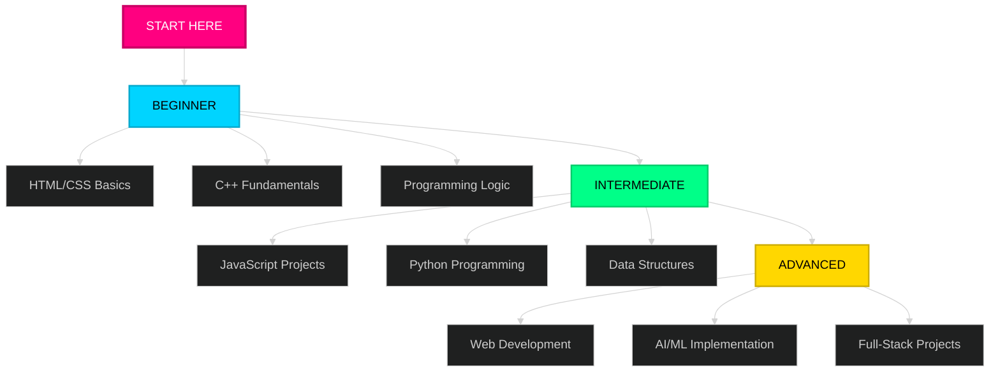
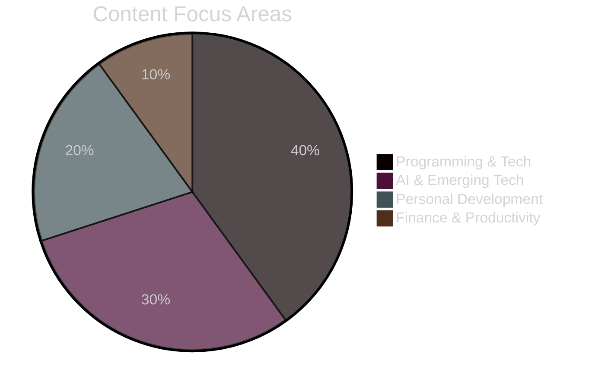

 <div align="center">

```
██████╗  ██████╗      ██╗██╗ ██████╗██████╗ ███████╗ █████╗ ████████╗███████╗███████╗
██╔══██╗██╔═══██╗     ██║██║██╔════╝██╔══██╗██╔════╝██╔══██╗╚══██╔══╝██╔════╝██╔════╝
██║  ██║██║   ██║     ██║██║██║     ██████╔╝█████╗  ███████║   ██║   █████╗  ███████╗
██║  ██║██║   ██║██   ██║██║██║     ██╔══██╗██╔══╝  ██╔══██║   ██║   ██╔══╝  ╚════██║
██████╔╝╚██████╔╝╚█████╔╝██║╚██████╗██║  ██║███████╗██║  ██║   ██║   ███████╗███████║
╚═════╝  ╚═════╝  ╚════╝ ╚═╝ ╚═════╝╚═╝  ╚═╝╚══════╝╚═╝  ╚═╝   ╚═╝   ╚══════╝╚══════╝
```

### `Empowering God-Fearing Filipino Developers Through Technology & Growth`


<div align="center">

---

---

<br><br>

### **Coding Tutorials**

<br>

<table>
<tr>
<td width="50%" align="center">

<a href="https://youtu.be/6XJ8294lC0c?si=hnEpeA_CLGzL1gMG">
  
</a>

[](https://youtu.be/6XJ8294lC0c)

<br>

</td>
<td width="50%" align="center">

<a href="https://youtu.be/Pyx9oLYpbi4?si=Aqr284t4U4DmPUJR">
  
</a>

[](https://youtu.be/Pyx9oLYpbi4)

<br>

</td>
</tr>
<tr>
<td width="50%" align="center">

<a href="https://youtu.be/xZ9umpUHRdU?si=wOZ9S9jMXe5jHn6l">
  
</a>

[](https://youtu.be/xZ9umpUHRdU)

<br>

</td>
<td width="50%" align="center">

<a href="https://youtu.be/te1eLWfdd0I?si=Tx2pQ-ijfx9BxW5M">
  
</a>

[](https://youtu.be/te1eLWfdd0I)

</td>
</tr>
</table>

### [**VIEW ALL TUTORIALS →**](https://youtube.com/@dojicreates)

<br><br><br>

</div>

---

---

<div align="center">

<br><br><br>

### SYSTEM.INITIALIZE()

<br><br>

<table>
<tr>
<td width="20%">

```javascript
const logic_NotLanguage = {
  foundation:
    "Wag ka munang magmadali matuto ng maraming programming languages, unahin mo muna ang pag-master ng problem-solving.",

  mindset:
    "Kapag naintindihan mo na kung paano mag-isip tulad ng isang programmer, madali na lang magpalit ng kahit anong language.",

  practice:
    "Mag-practice muna ng pseudocode, algorithms, at flowcharts bago ka lumalim sa syntax.",
};
```

</td>
<td width="20%">

```javascript
const build_SmallRealProjects = {
  action:
    "Huwag kang puro aral lang sa theory, mas matibay ang learning kapag ikaw mismo ang gumagawa at nag-e-experiment.",

  projects:
    "Simulan mo sa maliliit pero useful na projects tulad ng calculator, to-do list, o converter para masanay ka sa logic at flow.",

  growth:
    "Bawat project na matatapos mo ay unti-unting magpapatibay sa skills mo at magbibigay ng confidence bilang developer/programmer.",
};
```

</td>

<td width="20%">

```javascript
const stay_ConsistentlyCurious = {
  consistency:
    "Mag-code kahit kaunti araw-araw, dahil sa programming mas mahalaga ang consistency kaysa sa bilis.",

  curiosity:
    "Wag matakot magtanong o mag-search sa Google, kasama talaga sa pagiging developer ang pagre-research at pagde-debug.",

  growth:
    "Sundan ang mga tech trends tulad ng AI, web dev tools, at open-source projects para manatiling updated at lumago sa career mo.",
};
```

</td>
</tr>
</table>

<br><br><br>

---

---

</div>

<div align="center">

<br><br><br>

### CORE.MODULES

<br><br><br>

<table>
<tr>
<td align="center" width="25%">


### **PROGRAMMING**

The foundation of all tech innovation programming trains your logic, creativity, and problem-solving mindset. It’s where ideas turn into real-world applications that impact people’s lives.

</td>

<td align="center" width="25%">


### **AI & ROBOTICS**

Understanding AI and automation prepares you for the next era of technology. It’s where computers start thinking and machines begin learning, the probability runs on this.

</td>

<td align="center" width="25%">


### **GROWTH**

Tech alone isn’t enough mindset, habits, and discipline fuel consistency. Personal growth ensures that you don’t just code better, you _become_ better every day.

</td>

<td align="center" width="25%">


### **SELF DEVELOPMENT**

A strong body and clear mind lead to sustainable productivity. In tech, mental focus and physical well-being are your real long-term assets.

</td>
</tr>
</table>

<br><br><br>

</div>

---

---

<div align="center">

<br><br><br>

### ⚙️ TECH.STACK

<br><br><br>

<table>
<tr>
<td align="center" width="20%">
<br><strong>HTML5</strong>
</td>
<td align="center" width="20%">
<br><strong>CSS3</strong>
</td>
<td align="center" width="20%">
<br><strong>JavaScript</strong>
</td>
<td align="center" width="20%">
<br><strong>TypeScript</strong>
</td>
<td align="center" width="20%">
<br><strong>React</strong>
</td>
</tr>

<tr>
<td align="center" width="20%">
<br><strong>Tailwind CSS</strong>
</td>
<td align="center" width="20%">
<br><strong>Node.js</strong>
</td>
<td align="center" width="20%">
<br><strong>Flutter</strong>
</td>
<td align="center" width="20%">
<br><strong>C Language</strong>
</td>
<td align="center" width="20%">
<br><strong>C++</strong>
</td>
</tr>

<tr>
<td align="center" width="20%">
<br><strong>Python</strong>
</td>
<td align="center" width="20%">
<br><strong>Java</strong>
</td>
<td align="center" width="20%">
<br><strong>Git</strong>
</td>
<td align="center" width="20%">
<br><strong>VS Code</strong>
</td>
<td align="center" width="20%">
<br><strong>GitHub</strong>
</td>
</tr>
</table>

<br><br><br>

</div>

---

---

<div align="center">

<br><br><br>

### MISSION.STATEMENT

<br><br>

<table>
<tr>
<td>

> ### _"Awakening the greatness of God-fearing Filipino developers through accessible Tagalog programming education. In a world drowning in information, I create clarity. Through code, I build solutions. Through content, I share knowledge. Through consistency, I inspire action."_

<br>

<table align="center">
<tr>
<td align="center">

<br><strong>CLARITY</strong>
<br>
<sub>Tagalog explanations</sub>
</td>
<td align="center">

<br><strong>VALUE</strong>
<br>
<sub>Free quality content</sub>
</td>
<td align="center">

<br><strong>CONSISTENCY</strong>
<br>
<sub>Regular tutorials</sub>
</td>
<td align="center">

<br><strong>INNOVATION</strong>
<br>
<sub>Modern tech education</sub>
</td>
<td align="center">

<br><strong>FAITH</strong>
<br>
<sub>God-honoring work</sub>
</td>
</tr>
</table>

</td>
</tr>
</table>

</div>

---

## CONTENT.PHILOSOPHY

<div align="center">

<table>
<tr>
<td align="center" width="33%">


### **EDUCATE**

Tagalog programming tutorials  
Free for all Filipino learners

</td>
<td align="center" width="33%">


### **INSPIRE**

Showing what's achievable  
Building Filipino tech excellence

</td>
<td align="center" width="33%">


### **EMPOWER**

Practical skills & projects  
Real-world applications

</td>
</tr>
</table>

</div>


<div align="center">


</div>

<div align="center">



</div>

---

---

<div align="center">

<br><br><br>

### CONTENT.DISTRIBUTION

<br><br><br>



<br><br><br>

</div>

---

---

<div align="center">

<br><br><br><br>

### TUTORIAL.CATEGORIES

<br><br>

|                             **Web Dev**                             |                               **C++**                               |                             **Python**                              |                              **Java**                               |                              **AI/ML**                              |
| :-----------------------------------------------------------------: | :-----------------------------------------------------------------: | :-----------------------------------------------------------------: | :-----------------------------------------------------------------: | :-----------------------------------------------------------------: |
|                            HTML5 Basics                             |                         Syntax & Structure                          |                           Getting Started                           |                            OOP Concepts                             |                           Neural Networks                           |
|                             CSS Styling                             |                           Data Structures                           |                            File Handling                            |                             Inheritance                             |                            ML Algorithms                            |
|                             JavaScript                              |                             Algorithms                              |                              Libraries                              |                            Polymorphism                             |                             Automation                              |
|  |  |  |  |  |

<br><br><br><br>

</div>

---

---

<div align="center">

<br><br><br><br>

### RESOURCES.AVAILABLE

<br><br>

<table>
<tr>
<td align="center" width="25%">


### **Tutorials**

Full-length Tagalog coding lessons

</td>
<td align="center" width="25%">


### **PDF Notes**

Downloadable study materials & guides

</td>
<td align="center" width="25%">


### **Source Code**

GitHub repos & project files

</td>
<td align="center" width="25%">


### **Dev Tools**

Utilities & helper  
applications

</td>
</tr>
</table>

</div>

<br><br><br><br>

---

---

<div align="center">

<br><br><br>

<table>
<tr>
<td align="center">

### **Join the Community**

[](https://facebook.com/dojicreates)
[](https://instagram.com/dojicreates)
[](https://tiktok.com/@dojicreates)
[](https://youtube.com/@dojicreates)

[](https://dojicreates.com)

</td>
</tr>
</table>

<br><br>

### **COLLABORATION OPPORTUNITIES**

<br>


<br><br>

</div>

---

---

<div align="center">

<br><br>

### _Always Remember_

<br>

<table>
<tr>
<td>

> ### _"... Ang Panginoon ay nagbibigay ng karunungan, sa kaniyang bibig nanggagaling ang kaalaman at kaunawaan."_
>
> Sa lahat ng mabuting bagay na ating matututunan, ang lagi nating pasasalamat ay sa Dios lamang.

<br>

<br>

</td>
</tr>
</table>

<br>


---

<br>

**STATUS: ` ONLINE`** | **UPDATED: `2025`** | **AWAKEN THE GREATNESS** | **EOF**

</div>
