<div align="center">
  
</div>

<div align="center">
  <p><em>⚡ Empowering minds through technology, code, and growth</em></p>
</div>

<div align="center">
  <a href="https://facebook.com/dojicreates" target="_blank"></a>
  <a href="https://instagram.com/dojicreates" target="_blank"></a>
  <a href="https://tiktok.com/@dojicreates" target="_blank"></a>
  <a href="https://youtube.com/@dojicreates" target="_blank"></a>
</div>

---

## 🎯 System Initialization

<div align="center">

| **Identity** | **Mission** | **Status** |
|--------------|-------------|------------|
| Digital Creator | Tech + Growth | 🟢 ONLINE |

</div>

**Focus Areas:**
- Programming
- AI & Robotics
- Self Development
- Finance
- Productivity

---

## ⚡ Core Modules

<div align="center">

<table>
  <tr>
    <td align="center" width="33%">
      
      <br><strong>💻 Technology</strong>
      <br><small>Web Development | Programming Fundamentals | AI & Machine Learning | Robotics & Automation</small>
    </td>
    <td align="center" width="33%">
      
      <br><strong>🤖 AI & Robotics</strong>
      <br><small>Neural Networks | Machine Learning | Automation Systems | Intelligent Solutions</small>
    </td>
    <td align="center" width="33%">
      
      <br><strong>🚀 Growth</strong>
      <br><small>Self Development | Financial Intelligence | Productivity Systems | Mindset Engineering</small>
    </td>
  </tr>
</table>

</div>

---

## 📡 Latest Transmissions

<div align="center">

### 🎥 Featured Video Content

<table>
  <tr>
    <td width="50%" align="center">
      #### [V.001] CODING FOR BEGINNERS AND INTRODUCTION TO PYTHON
      <br>
      [](https://youtu.be/9QKe2RvjG-A?si=example)
      <br>
      <small>Aug 16, 2025</small>
      <br>
      [](https://youtu.be/9QKe2RvjG-A)
    </td>
    <td width="50%" align="center">
      #### [V.002] AVERARAGE OF A NUMBER IN C++ ACTIVITIES
      <br>
      [](https://youtu.be/KmCPui9Q6Ts?si=example)
      <br>
      <small>Aug 14, 2025</small>
      <br>
      [](https://youtu.be/KmCPui9Q6Ts)
    </td>
  </tr>
  <tr>
    <td width="50%" align="center">
      #### [V.003] MATCH CASE IN PYTHON LESSON 19
      <br>
      [](https://youtu.be/nRhyi1cl2C0?si=example)
      <br>
      <small>Jul 20, 2025</small>
      <br>
      [](https://youtu.be/nRhyi1cl2C0)
    </td>
    <td width="50%" align="center">
      #### [V.004] DISPLAY METHOD - C++ LESSON 1
      <br>
      [](https://youtu.be/te1eLWfdd0I?si=example)
      <br>
      <small>Jul 8, 2024</small>
      <br>
      [](https://youtu.be/te1eLWfdd0I)
    </td>
  </tr>
</table>

</div>

---

## 🛠️ Tech Stack

<div align="center">

<table>
  <tr>
    <td align="center" width="25%">
      
      <br><strong>HTML5</strong>
    </td>
    <td align="center" width="25%">
      
      <br><strong>CSS3</strong>
    </td>
    <td align="center" width="25%">
      
      <br><strong>JavaScript</strong>
    </td>
    <td align="center" width="25%">
      
      <br><strong>Git</strong>
    </td>
  </tr>
</table>


</div>

---

## 📊 Content Distribution

<div align="center">


<table>
  <tr>
    <td align="center" width="25%">
      
      <br><strong>Facebook</strong>
      <br><small>Long-form discussions</small>
    </td>
    <td align="center" width="25%">
      
      <br><strong>Instagram</strong>
      <br><small>Visual storytelling</small>
    </td>
    <td align="center" width="25%">
      
      <br><strong>TikTok</strong>
      <br><small>Quick insights</small>
    </td>
    <td align="center" width="25%">
      
      <br><strong>YouTube</strong>
      <br><small>Deep-dive tutorials</small>
    </td>
  </tr>
</table>

</div>

---

## 💡 Mission Statement

<div align="center">

> *"In a world drowning in information, I create clarity. Through code, I build solutions. Through content, I share knowledge. Through consistency, I inspire action."*

<div align="center">

<table>
  <tr>
    <td align="center">
      
      <br><strong>Clarity</strong>
      <br><small>Breaking complexity</small>
    </td>
    <td align="center">
      
      <br><strong>Value</strong>
      <br><small>Serving the audience</small>
    </td>
    <td align="center">
      
      <br><strong>Consistency</strong>
      <br><small>Building trust</small>
    </td>
    <td align="center">
      
      <br><strong>Innovation</strong>
      <br><small>Embracing change</small>
    </td>
    <td align="center">
      
      <br><strong>Authenticity</strong>
      <br><small>Real experiences</small>
    </td>
  </tr>
</table>

</div>

</div>

---

## 🚀 Content Philosophy

<div align="center">

<table>
  <tr>
    <td align="center" width="33%">
      
      <br><strong>📚 Educate</strong>
      <br><small>Providing technical knowledge and practical skills</small>
    </td>
    <td align="center" width="33%">
      
      <br><strong>⚡ Inspire</strong>
      <br><small>Showing what's possible through technology</small>
    </td>
    <td align="center" width="33%">
      
      <br><strong>💪 Empower</strong>
      <br><small>Tools and frameworks for success</small>
    </td>
  </tr>
</table>

</div>

---

## 📈 Growth Trajectory

<div align="center">


<table>
  <tr>
    <td align="center" width="33%">
      <strong>🎯 2025</strong>
      <br>✅ Scale Production
      <br>✅ Community Expansion
      <br>✅ Strategic Partnerships
      <br>✅ Revenue Diversification
    </td>
    <td align="center" width="33%">
      <strong>🚀 2026</strong>
      <br>⚡ Industry Leadership
      <br>⚡ Product Development
      <br>⚡ Educational Platform
      <br>⚡ Global Reach
    </td>
    <td align="center" width="33%">
      <strong>🌟 Future</strong>
      <br>🔥 Sustainable Innovation
      <br>🔥 Mentorship Programs
      <br>🔥 Collaborative Projects
      <br>🔥 Lasting Legacy
    </td>
  </tr>
</table>

</div>

---

## 🎓 Learning Path

```mermaid
graph TD
    START[🎯 START HERE] --> A[📘 BEGINNER]
    A --> A1[Web Fundamentals]
    A --> A2[Programming Basics]
    A --> A3[Intro to AI]
   
    A --> B[📗 INTERMEDIATE]
    B --> B1[Advanced JavaScript]
    B --> B2[Project Building]
    B --> B3[Productivity Systems]
   
    B --> C[📕 ADVANCED]
    C --> C1[Full-Stack Dev]
    C --> C2[AI/ML Implementation]
    C --> C3[Business & Monetization]
   
    style START fill:#ff0080,stroke:#cc0066,stroke-width:3px,color:#fff
    style A fill:#00d4ff,stroke:#00a8cc,stroke-width:2px,color:#000
    style B fill:#00ff88,stroke:#00cc6a,stroke-width:2px,color:#000
    style C fill:#ffd700,stroke:#ccac00,stroke-width:2px,color:#000
```

<div align="center">



</div>

---

## 📚 Popular Topics

<div align="center">

| 💻 **Programming** | 🤖 **AI/ML** | 📈 **Growth** | 💰 **Finance** | ⚡ **Productivity** |
|:---:|:---:|:---:|:---:|:---:|
| Web Dev | Neural Networks | Habits | Investing | Time Management |
| Algorithms | Automation | Mindset | Budgeting | Tools & Apps |
| Clean Code | ML Models | Goals | Wealth Building | Workflows |
|  |  |  |  |  |

</div>

---

## ⚙️ System Status

<div align="center">

<table>
  <tr>
    <td align="center">
      
    </td>
    <td align="center">
      
    </td>
    <td align="center">
      
    </td>
  </tr>
</table>

```yaml
operating_mode: CREATOR • EDUCATOR • STRATEGIST
update_frequency: DAILY CONTENT CYCLES
platform_status: MULTI-CHANNEL ACTIVE
engagement_level: HIGH-TOUCH COMMUNITY
content_quality: PREMIUM STANDARD
innovation_index: CUTTING EDGE
```

</div>

---

## 🌐 Connect

<div align="center">

### Let's Build Together

[](https://facebook.com/dojicreates)
[](https://instagram.com/dojicreates)
[](https://tiktok.com/@dojicreates)
[](https://youtube.com/@dojicreates)

### 🎯 Collaboration Opportunities


</div>

---

## ✨ Final Message

<div align="center">

> *"The future belongs to those who code it, design it, and create it."*
>
> Whether you're writing your first line of code, launching your first project, or optimizing your life for peak performance—**this is your space to learn, grow, and transform.**

### 🚀 Let's build something remarkable together.

</div>

<div align="center">
  
</div>

---

<div align="center">

### 📊 Profile Stats


**Status:** `🟢 ONLINE` | **Last Updated:** `October 2025` | **EOF**

</div>
