<div align="center">

```
██████╗  ██████╗      ██╗██╗ ██████╗██████╗ ███████╗ █████╗ ████████╗███████╗███████╗
██╔══██╗██╔═══██╗     ██║██║██╔════╝██╔══██╗██╔════╝██╔══██╗╚══██╔══╝██╔════╝██╔════╝
██║  ██║██║   ██║     ██║██║██║     ██████╔╝█████╗  ███████║   ██║   █████╗  ███████╗
██║  ██║██║   ██║██   ██║██║██║     ██╔══██╗██╔══╝  ██╔══██║   ██║   ██╔══╝  ╚════██║
██████╔╝╚██████╔╝╚█████╔╝██║╚██████╗██║  ██║███████╗██║  ██║   ██║   ███████╗███████║
╚═════╝  ╚═════╝  ╚════╝ ╚═╝ ╚═════╝╚═╝  ╚═╝╚══════╝╚═╝  ╚═╝   ╚═╝   ╚══════╝╚══════╝
```


### `⚡ Empowering God-Fearing Filipino Developers Through Technology & Growth`

<a href="https://facebook.com/dojicreates" target="_blank"></a>
<a href="https://instagram.com/dojicreates" target="_blank"></a>
<a href="https://tiktok.com/@dojicreates" target="_blank"></a>
<a href="https://youtube.com/@dojicreates" target="_blank"></a>


## 📡 LATEST.CONTENT

<div align="center">

### 🎥 **Featured YouTube Tutorials**

<table>
<tr>
<td width="50%" align="center">

<a href="https://youtu.be/6XJ8294lC0c?si=hnEpeA_CLGzL1gMG">
  
</a>

**`Tutorial #001`**

[](https://youtu.be/6XJ8294lC0c)

</td>
<td width="50%" align="center">

<a href="https://youtu.be/Pyx9oLYpbi4?si=Aqr284t4U4DmPUJR">
  
</a>

**`Tutorial #002`**

[](https://youtu.be/Pyx9oLYpbi4)

</td>
</tr>
<tr>
<td width="50%" align="center">

<a href="https://youtu.be/xZ9umpUHRdU?si=wOZ9S9jMXe5jHn6l">
  
</a>

**`Tutorial #003`**

[](https://youtu.be/xZ9umpUHRdU)

</td>
<td width="50%" align="center">

<a href="https://youtu.be/te1eLWfdd0I?si=Tx2pQ-ijfx9BxW5M">
  
</a>

**`Tutorial #004`**

[](https://youtu.be/te1eLWfdd0I)

</td>
</tr>
</table>

### 📺 [**VIEW ALL TUTORIALS →**](https://youtube.com/@dojicreates)

</div>


</div>

## 🎯 SYSTEM.INITIALIZE()

<table>
<tr>
<td width="50%">

```javascript
const dojicreates = {
  identity: "Tech Educator",
  mission: "Filipino Dev Excellence",
  language: "Tagalog + English",
  status: "🟢 ONLINE"
};
```

</td>
<td width="50%">

```yaml
core_focus:
  - Tagalog Coding Tutorials
  - Programming (C++, Python, JS)
  - AI & Robotics
  - Web Development
  - CS/IT Education
```

</td>
</tr>
</table>

---

## ⚡ CORE.MODULES

<div align="center">

<table>
<tr>
<td align="center" width="33%">


### 💻 **PROGRAMMING**
`C++ Tutorials`  
`JavaScript & Web Dev`  
`Python Programming`  
`Java & OOP Concepts`

</td>
<td align="center" width="33%">


### 🤖 **AI & ROBOTICS**
`Machine Learning Basics`  
`AI Implementation`  
`Automation Systems`  
`Robotics Projects`

</td>
<td align="center" width="33%">


### 🚀 **GROWTH**
`Self Development`  
`Financial Intelligence`  
`Productivity Systems`  
`Tech Career Growth`

</td>
</tr>
</table>

</div>

---

## 🎓 WHO.THIS.IS.FOR

<div align="center">

<table>
<tr>
<td align="center" width="25%">


### **CS/IT Students**
BSCS • BSIT • BSIS  
BSCPE • ICT Programs

</td>
<td align="center" width="25%">


### **Beginners**
Starting your  
coding journey

</td>
<td align="center" width="25%">


### **Filipino Devs**
Learning in  
Tagalog

</td>
<td align="center" width="25%">


### **Career Shifters**
Transitioning to  
tech careers

</td>
</tr>
</table>

</div>

---

## 🛠️ TECH.STACK

<div align="center">

<table>
<tr>
<td align="center" width="20%">

<br><strong>HTML5</strong>
</td>
<td align="center" width="20%">

<br><strong>CSS3</strong>
</td>
<td align="center" width="20%">

<br><strong>JavaScript</strong>
</td>
<td align="center" width="20%">

<br><strong>C++</strong>
</td>
<td align="center" width="20%">

<br><strong>Python</strong>
</td>
</tr>
</table>


</div>

---

## 📊 CONTENT.DISTRIBUTION

<div align="center">


<table>
<tr>
<td align="center" width="25%">

<br>
<strong>Facebook</strong>
<br>
<sub>Coding discussions & community</sub>
</td>
<td align="center" width="25%">

<br>
<strong>Instagram</strong>
<br>
<sub>Quick tips & inspiration</sub>
</td>
<td align="center" width="25%">

<br>
<strong>TikTok</strong>
<br>
<sub>Short coding tutorials</sub>
</td>
<td align="center" width="25%">

<br>
<strong>YouTube</strong>
<br>
<sub>Full Tagalog tutorials</sub>
</td>
</tr>
</table>

</div>

---

## 💡 MISSION.STATEMENT

<div align="center">

<table>
<tr>
<td>

> ### *"Awakening the greatness of God-fearing Filipino developers through accessible Tagalog programming education. In a world drowning in information, I create clarity. Through code, I build solutions. Through content, I share knowledge. Through consistency, I inspire action."*

<br>

<table>
<tr>
<td align="center">

<br><strong>CLARITY</strong>
<br>
<sub>Tagalog explanations</sub>
</td>
<td align="center">

<br><strong>VALUE</strong>
<br>
<sub>Free quality content</sub>
</td>
<td align="center">

<br><strong>CONSISTENCY</strong>
<br>
<sub>Regular tutorials</sub>
</td>
<td align="center">

<br><strong>INNOVATION</strong>
<br>
<sub>Modern tech education</sub>
</td>
<td align="center">

<br><strong>FAITH</strong>
<br>
<sub>God-honoring work</sub>
</td>
</tr>
</table>

</td>
</tr>
</table>

</div>

---

## 🚀 CONTENT.PHILOSOPHY

<div align="center">

<table>
<tr>
<td align="center" width="33%">


### 📚 **EDUCATE**
Tagalog programming tutorials  
Free for all Filipino learners

</td>
<td align="center" width="33%">


### ⚡ **INSPIRE**
Showing what's achievable  
Building Filipino tech excellence

</td>
<td align="center" width="33%">


### 💪 **EMPOWER**
Practical skills & projects  
Real-world applications

</td>
</tr>
</table>

</div>

---

## 📈 GROWTH.TRAJECTORY

<div align="center">


<table>
<tr>
<td align="center" width="33%">

### 🎯 **2024**
✅ Platform Building  
✅ Content Consistency  
✅ Community Growth  
✅ Tagalog Tutorial Library

</td>
<td align="center" width="33%">

### 🚀 **2025**
⚡ Scale Production  
⚡ Community Expansion  
⚡ Strategic Partnerships  
⚡ Educational Platform

</td>
<td align="center" width="33%">

### 🌟 **FUTURE**
🔥 Filipino Dev Leadership  
🔥 Product Development  
🔥 Tech Education Hub  
🔥 Global Filipino Devs

</td>
</tr>
</table>

</div>

---

## 🎓 LEARNING.PATH

```mermaid
%%{init: {'theme':'dark', 'themeVariables': {'fontSize': '16px'}}}%%
graph TD
    START["🎯 START HERE"] --> A["📘 BEGINNER"]
    A --> A1[HTML/CSS Basics]
    A --> A2[C++ Fundamentals]
    A --> A3[Programming Logic]
    
    A --> B["📗 INTERMEDIATE"]
    B --> B1[JavaScript Projects]
    B --> B2[Python Programming]
    B --> B3[Data Structures]
    
    B --> C["📕 ADVANCED"]
    C --> C1[Web Development]
    C --> C2[AI/ML Implementation]
    C --> C3[Full-Stack Projects]
    
    style START fill:#ff0080,stroke:#cc0066,stroke-width:3px,color:#fff
    style A fill:#00d4ff,stroke:#00a8cc,stroke-width:2px,color:#000
    style B fill:#00ff88,stroke:#00cc6a,stroke-width:2px,color:#000
    style C fill:#ffd700,stroke:#ccac00,stroke-width:2px,color:#000
```

<div align="center">



</div>


## 📚 TUTORIAL.CATEGORIES

<div align="center">

| 💻 **Web Dev** | 🔧 **C++** | 🐍 **Python** | ☕ **Java** | 🤖 **AI/ML** |
|:---:|:---:|:---:|:---:|:---:|
| HTML5 Basics | Syntax & Structure | Getting Started | OOP Concepts | Neural Networks |
| CSS Styling | Data Structures | File Handling | Inheritance | ML Algorithms |
| JavaScript | Algorithms | Libraries | Polymorphism | Automation |
|  |  |  |  |  |

</div>


## 📦 RESOURCES.AVAILABLE

<div align="center">

<table>
<tr>
<td align="center" width="25%">


### 🎥 **Video Tutorials**
Full-length Tagalog  
coding lessons

</td>
<td align="center" width="25%">


### 📄 **PDF Notes**
Downloadable study  
materials & guides

</td>
<td align="center" width="25%">


### 💻 **Source Code**
GitHub repos &  
project files

</td>
<td align="center" width="25%">


### 🛠️ **Dev Tools**
Utilities & helper  
applications

</td>
</tr>
</table>

</div>


## ⚙️ SYSTEM.STATUS

<div align="center">

<table>
<tr>
<td align="center">


</td>
<td align="center">


</td>
<td align="center">


</td>
</tr>
</table>

```yaml
operating_mode:     EDUCATOR • CONTENT CREATOR • COMMUNITY BUILDER
language:           TAGALOG + ENGLISH
update_frequency:   REGULAR TUTORIAL UPLOADS
platform_status:    MULTI-CHANNEL ACTIVE
target_audience:    FILIPINO DEVELOPERS
content_quality:    FREE PREMIUM TUTORIALS
commitment:         GOD-FEARING • EXCELLENCE-DRIVEN
```

</div>


## 🌐 CONNECT.WITH.ME

<div align="center">

<table>
<tr>
<td align="center">

### **Join the Community**

[](https://facebook.com/dojicreates)
[](https://instagram.com/dojicreates)
[](https://tiktok.com/@dojicreates)
[](https://youtube.com/@dojicreates)

### 🌐 **Official Website**
[](https://dojicreates.com)

</td>
</tr>
</table>

### 🎯 **COLLABORATION OPPORTUNITIES**


</div>


## ✨ FINAL.MESSAGE

<div align="center">

<table>
<tr>
<td>

<br>

> ### *"Para sa lahat ng Filipino developers na may pangarap: The future belongs to those who code it, design it, and create it."*
> 
> Whether you're a **CS/IT student**, writing your **first line of code**, or **transitioning to tech**—this is your space to learn programming **in Tagalog**, grow together, and build the future.

<br>

### 🚀 **Sama-sama tayong matuto at lumago. Let's code the future together!**

<br>

</td>
</tr>
</table>

<br>


---

### 📊 **PROFILE STATS**


---

**STATUS: `🟢 ONLINE`** | **UPDATED: `2025`** | **AWAKEN THE GREATNESS** | **EOF**

</div>
