```mermaid
graph TD
    START[🎯 START HERE] --> A[📘 BEGINNER]
    A --> A1[Web Fundamentals]
    A --> A2[Programming Basics]
    A --> A3[Intro to AI]
   
    A --> B[📗 INTERMEDIATE]
    B --> B1[Advanced JavaScript]
    B --> B2[Project Building]
    B --> B3[Productivity Systems]
   
    B --> C[📕 ADVANCED]
    C --> C1[Full-Stack Dev]
    C --> C2[AI/ML Implementation]
    C --> C3[Business & Monetization]
   
    style START fill:#ff0080,stroke:#cc0066,stroke-width:3px,color:#fff
    style A fill:#00d4ff,stroke:#00a8cc,stroke-width:2px,color:#000
    style B fill:#00ff88,stroke:#00cc6a,stroke-width:2px,color:#000
    style C fill:#ffd700,stroke:#ccac00,stroke-width:2px,color:#000
```

<div align="center">

# 🚀 DOJICREATES


### `⚡ Empowering minds through technology, code, and growth`

[](https://facebook.com/dojicreates)
[](https://instagram.com/dojicreates)
[](https://tiktok.com/@dojicreates)
[](https://youtube.com/@dojicreates)


</div>

## 🎯 SYSTEM.INITIALIZE()

<table>
<tr>
<td width="50%">

```javascript
const dojicreates = {
  identity: "Digital Creator",
  mission: "Tech + Growth",
  status: "🟢 ONLINE"
};
```

</td>
<td width="50%">

```yaml
focus:
  - Programming
  - AI & Robotics
  - Self Development
  - Finance
  - Productivity
```

</td>
</tr>
</table>


## ⚡ CORE.MODULES

<div align="center">

<table>
<tr>
<td align="center" width="33%">


### 💻 **TECHNOLOGY**
`Web Development`  
`Programming Fundamentals`  
`AI & Machine Learning`  
`Robotics & Automation`

</td>
<td align="center" width="33%">


### 🤖 **AI & ROBOTICS**
`Neural Networks`  
`Machine Learning`  
`Automation Systems`  
`Intelligent Solutions`

</td>
<td align="center" width="33%">


### 🚀 **GROWTH**
`Self Development`  
`Financial Intelligence`  
`Productivity Systems`  
`Mindset Engineering`

</td>
</tr>
</table>

</div>


## 📡 LATEST.TRANSMISSIONS

<div align="center">

### 🎥 **Featured Video Content**

<table>
<tr>
<td width="50%" align="center">

#### `[V.001]`
[](https://youtu.be/6XJ8294lC0c?si=hnEpeA_CLGzL1gMG)
<br>
[](https://youtu.be/6XJ8294lC0c)

</td>
<td width="50%" align="center">

#### `[V.002]`
[](https://youtu.be/Pyx9oLYpbi4?si=Aqr284t4U4DmPUJR)
<br>
[](https://youtu.be/Pyx9oLYpbi4)

</td>
</tr>
<tr>
<td width="50%" align="center">

#### `[V.003]`
[](https://youtu.be/xZ9umpUHRdU?si=wOZ9S9jMXe5jHn6l)
<br>
[](https://youtu.be/xZ9umpUHRdU)

</td>
<td width="50%" align="center">

#### `[V.004]`
[](https://youtu.be/te1eLWfdd0I?si=Tx2pQ-ijfx9BxW5M)
<br>
[](https://youtu.be/te1eLWfdd0I)

</td>
</tr>
</table>

</div>


## 🛠️ TECH.STACK

<div align="center">

<table>
<tr>
<td align="center" width="25%">

<br><strong>HTML5</strong>
</td>
<td align="center" width="25%">

<br><strong>CSS3</strong>
</td>
<td align="center" width="25%">

<br><strong>JavaScript</strong>
</td>
<td align="center" width="25%">

<br><strong>Git</strong>
</td>
</tr>
</table>


</div>


## 📊 CONTENT.DISTRIBUTION

<div align="center">


<table>
<tr>
<td align="center" width="25%">

<br>
<strong>Facebook</strong>
<br>
<sub>Long-form discussions</sub>
</td>
<td align="center" width="25%">

<br>
<strong>Instagram</strong>
<br>
<sub>Visual storytelling</sub>
</td>
<td align="center" width="25%">

<br>
<strong>TikTok</strong>
<br>
<sub>Quick insights</sub>
</td>
<td align="center" width="25%">

<br>
<strong>YouTube</strong>
<br>
<sub>Deep-dive tutorials</sub>
</td>
</tr>
</table>

</div>


## 💡 MISSION.STATEMENT

<div align="center">

<table>
<tr>
<td>

> ### *"In a world drowning in information, I create clarity. Through code, I build solutions. Through content, I share knowledge. Through consistency, I inspire action."*

<br>

<table>
<tr>
<td align="center">

<br><strong>CLARITY</strong>
<br>
<sub>Breaking complexity</sub>
</td>
<td align="center">

<br><strong>VALUE</strong>
<br>
<sub>Serving the audience</sub>
</td>
<td align="center">

<br><strong>CONSISTENCY</strong>
<br>
<sub>Building trust</sub>
</td>
<td align="center">

<br><strong>INNOVATION</strong>
<br>
<sub>Embracing change</sub>
</td>
<td align="center">

<br><strong>AUTHENTICITY</strong>
<br>
<sub>Real experiences</sub>
</td>
</tr>
</table>

</td>
</tr>
</table>

</div>


## 🚀 CONTENT.PHILOSOPHY

<div align="center">

<table>
<tr>
<td align="center" width="33%">


### 📚 **EDUCATE**
Providing technical knowledge  
and practical skills

</td>
<td align="center" width="33%">


### ⚡ **INSPIRE**
Showing what's possible  
through technology

</td>
<td align="center" width="33%">


### 💪 **EMPOWER**
Tools and frameworks  
for success

</td>
</tr>
</table>

</div>


## 📈 GROWTH.TRAJECTORY

<div align="center">


<table>
<tr>
<td align="center" width="33%">

### 🎯 **2024**
✅ Foundation Building  
✅ Platform Establishment  
✅ Content Consistency  
✅ Audience Connection

</td>
<td align="center" width="33%">

### 🚀 **2025**
⚡ Scale Production  
⚡ Community Expansion  
⚡ Strategic Partnerships  
⚡ Revenue Diversification

</td>
<td align="center" width="33%">

### 🌟 **FUTURE**
🔥 Industry Leadership  
🔥 Product Development  
🔥 Educational Platform  
🔥 Global Impact

</td>
</tr>
</table>

</div>


## 🎓 LEARNING.PATH

<div align="center">



</div>


## 📚 POPULAR.TOPICS

<div align="center">

| 💻 **Programming** | 🤖 **AI/ML** | 📈 **Growth** | 💰 **Finance** | ⚡ **Productivity** |
|:---:|:---:|:---:|:---:|:---:|
| Web Dev | Neural Networks | Habits | Investing | Time Management |
| Algorithms | Automation | Mindset | Budgeting | Tools & Apps |
| Clean Code | ML Models | Goals | Wealth Building | Workflows |
|  |  |  |  |  |

</div>


## ⚙️ SYSTEM.STATUS

<div align="center">

<table>
<tr>
<td align="center">


</td>
<td align="center">


</td>
<td align="center">


</td>
</tr>
</table>

```yaml
operating_mode:     CREATOR • EDUCATOR • STRATEGIST
update_frequency:   DAILY CONTENT CYCLES
platform_status:    MULTI-CHANNEL ACTIVE
engagement_level:   HIGH-TOUCH COMMUNITY
content_quality:    PREMIUM STANDARD
innovation_index:   CUTTING EDGE
```

</div>


## 🌐 CONNECT

<div align="center">

<table>
<tr>
<td align="center">

### **Let's Build Together**

[](https://facebook.com/dojicreates)
[](https://instagram.com/dojicreates)
[](https://tiktok.com/@dojicreates)
[](https://youtube.com/@dojicreates)

</td>
</tr>
</table>

### 🎯 **COLLABORATION OPPORTUNITIES**


</div>


## ✨ FINAL.MESSAGE

<div align="center">

<table>
<tr>
<td>

<br>

> ### *"The future belongs to those who code it, design it, and create it."*
> 
> Whether you're writing your first line of code, launching your first project, or optimizing your life for peak performance—**this is your space to learn, grow, and transform.**

<br>

### 🚀 **Let's build something remarkable together.**

<br>

</td>
</tr>
</table>

<br>


---

### 📊 **PROFILE STATS**


---

**STATUS: `🟢 ONLINE`** | **LAST UPDATED: `2025`** | **EOF**

</div>
